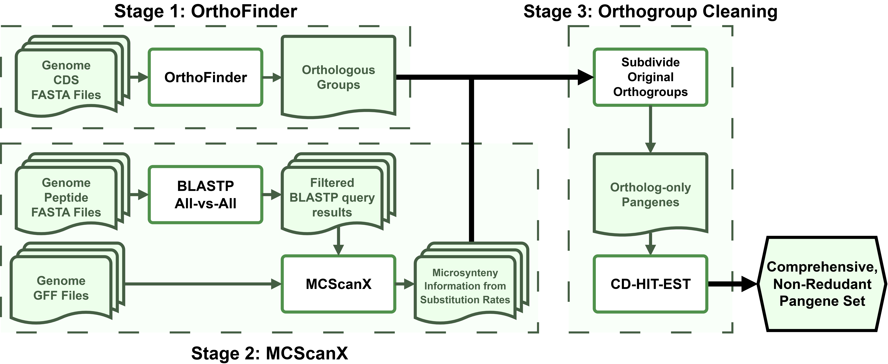

# pangene_pipeline

## Use
This tool requires an environment manager. It is recommended you use [mamba](https://mamba.readthedocs.io/en/latest/#), though [conda](https://docs.conda.io/en/latest/) also works.


Once you have created your configuration file and installed the necessary dependencies, the pipeline can be run using the following command:
```bash
$ python pipeline.py --config config.toml
```

**Note:** in the future, some dependencies may be installed/found via a separate process and errors handled during installation/runtime. Currently, it will be assumed all external tools are on the user's `PATH`.


## Pipeline Organization


